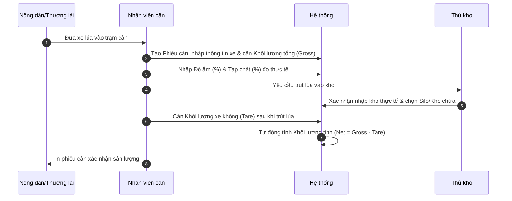
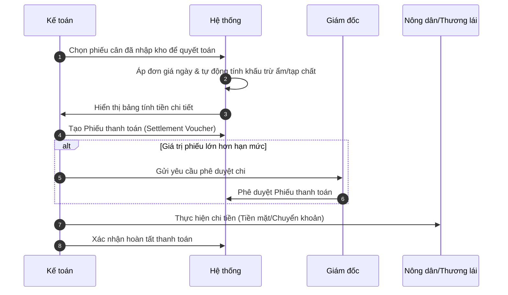

# Tài liệu Đặc tả Nghiệp vụ - RiceOS

Tài liệu này đặc tả chi tiết quy trình nghiệp vụ, phân quyền vai trò và luồng dữ liệu cho hệ thống **RiceOS** tại khách hàng triển khai đầu tiên: **Hợp tác xã Nông nghiệp Hòa Tiến 2**.

---

## 1. Vai trò người dùng & Phân quyền (Roles & Permissions)

Hệ thống phân quyền chặt chẽ dựa trên chức năng nhiệm vụ thực tế của từng nhân sự tại Hợp tác xã:

### 1.1. Ban quản trị (Administrator)
* **Nhiệm vụ:** Thiết lập tham số hệ thống.
* **Quyền hạn:**
  * Quản lý danh mục người dùng (thêm mới, khóa tài khoản, phân vai trò).
  * Quản lý danh mục lúa (Đài Thơm 8, OM18, Khang Dân,...).
  * Cập nhật bảng giá thu mua cơ bản theo ngày hoặc theo vụ mùa.
  * Cấu hình tỷ lệ khấu trừ độ ẩm tiêu chuẩn và tạp chất tiêu chuẩn.
  * Xem nhật ký hệ thống (Audit logs).

### 1.2. Nhân viên cân (Weighing Officer)
* **Nhiệm vụ:** Ghi nhận khối lượng và chất lượng lúa khi xe hàng vào trạm thu mua.
* **Quyền hạn:**
  * Lập Phiếu cân mới (chọn nông dân/thương lái, loại lúa, biển số xe).
  * Nhập khối lượng tổng (Gross Weight - xe + lúa).
  * Nhập khối lượng xe không (Tare Weight - vỏ xe sau khi trút lúa) để tính Khối lượng tịnh (Net Weight).
  * Nhập kết quả đo độ ẩm (%) và tạp chất (%) thực tế từ máy đo.
  * In phiếu cân tạm thời cho tài xế/nông dân.

### 1.3. Thủ kho (Warehouse)
* **Nhiệm vụ:** Xác nhận lúa đã được đổ vào đúng kho/silo chứa thực tế.
* **Quyền hạn:**
  * Xem danh sách các phiếu cân đang chờ nhập kho.
  * Xác nhận đã nhận hàng thực tế và chỉ định Silo/Kho chứa lúa tương ứng.
  * Ghi nhận hao hụt, tình trạng chất lượng lúa lưu kho (mốc, mối mọt nếu có).
  * Theo dõi số lượng tồn kho theo thời gian thực của từng loại lúa và từng lô hàng.

### 1.4. Kế toán (Accountant)
* **Nhiệm vụ:** Tính toán tài chính, đối chiếu và thực hiện thanh toán cho nông dân/thương lái.
* **Quyền hạn:**
  * Tiếp nhận các phiếu cân đã được Thủ kho xác nhận nhập kho.
  * Kiểm tra và áp đơn giá chính thức (có thể điều chỉnh nhẹ dựa trên thỏa thuận đặc biệt được duyệt).
  * Tự động tính toán số tiền khấu trừ ẩm/tạp chất và số tiền thực tế phải thanh toán.
  * Lập Phiếu thanh toán (Settlement Voucher) gửi Giám đốc phê duyệt (nếu vượt hạn mức) hoặc trực tiếp chi tiền.
  * Ghi nhận trạng thái thanh toán (Chờ thanh toán, Đã thanh toán, Đã chuyển khoản).

### 1.5. Giám đốc (Director)
* **Nhiệm vụ:** Giám sát vận hành toàn diện và phê duyệt các quyết định tài chính lớn.
* **Quyền hạn:**
  * Xem Dashboard báo cáo trực quan về: Tổng sản lượng thu mua, Tổng số tiền đã thanh toán, Tồn kho hiện tại.
  * Phê duyệt các Phiếu thanh toán có giá trị lớn vượt hạn mức của Kế toán.
  * Phê duyệt điều chỉnh giá thu mua đặc biệt.
  * Tra cứu toàn bộ lịch sử giao dịch thu mua và thanh toán của Hợp tác xã.

---

## 2. Quy trình Nghiệp vụ Cốt lõi (Core Workflows)

### 2.1. Quy trình Thu mua & Cân hàng (Procurement & Weighing Workflow)

### 2.2. Quy trình Tính giá & Quyết toán (Settlement Workflow)

---

## 3. Quy tắc Tính toán Quyết toán tiêu chuẩn

Số tiền thanh toán thực tế cho mỗi lô lúa được tính toán theo công thức chuẩn hóa sau:

1. **Khối lượng tịnh thực tế (Net Weight):**
   $$\text{Khối lượng tịnh} = \text{Khối lượng tổng (Gross)} - \text{Khối lượng bì (Tare)}$$

2. **Khối lượng quy đổi thanh toán (Settlement Weight):**
   * Nếu độ ẩm thực tế ($\text{Moisture}_{\text{act}}$) lớn hơn độ ẩm tiêu chuẩn ($\text{Moisture}_{\text{std}}$, thường là 14%):
     $$\text{Khối lượng quy đổi} = \text{Khối lượng tịnh} \times \left(1 - \frac{\text{Moisture}_{\text{act}} - \text{Moisture}_{\text{std}}}{100}\right)$$
   * Nếu tạp chất thực tế ($\text{Trash}_{\text{act}}$) lớn hơn tạp chất tiêu chuẩn ($\text{Trash}_{\text{std}}$, thường là 1%):
     $$\text{Khối lượng quy đổi} = \text{Khối lượng quy đổi} \times \left(1 - \frac{\text{Trash}_{\text{act}} - \text{Trash}_{\text{std}}}{100}\right)$$
   * Nếu độ ẩm và tạp chất đạt chuẩn hoặc thấp hơn chuẩn, giữ nguyên khối lượng tịnh để tính tiền.

3. **Số tiền thanh toán thực tế (Total Settlement Amount):**
   $$\text{Tổng tiền thanh toán} = \text{Khối lượng quy đổi} \times \text{Đơn giá lúa}$$

---

## 4. Đặc tả Dữ liệu Cơ bản (Core Entities)

Dự án RiceOS sẽ xoay quanh các đối tượng dữ liệu chính sau:

* **`Farmer` (Nông dân/Thương lái):** Mã nông dân, Họ tên, Số điện thoại, Địa chỉ, Số tài khoản ngân hàng, Tên ngân hàng.
* **`RiceVariety` (Danh mục lúa):** Mã loại lúa, Tên loại lúa (ví dụ: OM18), Mô tả, Giá cơ bản hiện tại.
* **`Warehouse` (Danh mục kho/silo):** Mã kho, Tên kho, Sức chứa tối đa (tấn), Tồn kho hiện tại.
* **`WeighingReceipt` (Phiếu cân):** Mã phiếu cân, Mã nông dân, Biển số xe, Loại lúa, Khối lượng tổng, Khối lượng bì, Khối lượng tịnh, Độ ẩm, Tạp chất, Trạng thái (Mới tạo, Đã nhập kho, Đã thanh toán), Người cân, Thời gian cân.
* **`SettlementVoucher` (Phiếu thanh toán):** Mã phiếu chi, Mã phiếu cân liên kết, Đơn giá áp dụng, Khối lượng thanh toán, Tổng tiền thanh toán, Hình thức chi (Tiền mặt/Chuyển khoản), Trạng thái (Chờ duyệt, Đã duyệt, Đã thanh toán), Kế toán lập, Thời gian lập.
