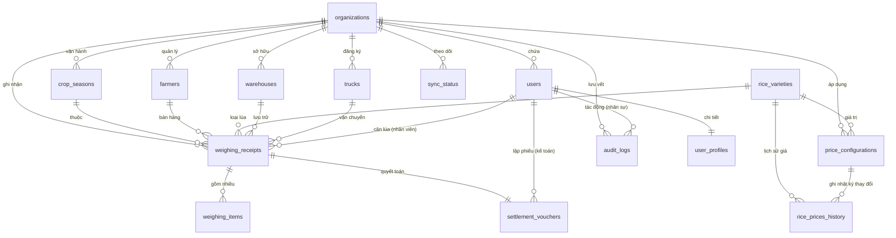

# THIẾT KẾ CƠ SỞ DỮ LIỆU HOÀN THIỆN (DATABASE SCHEMA FINAL)
## RiceOS - Hệ thống Quản lý Thu mua Lúa gạo Thông minh

* **Dự án:** RiceOS
* **Phiên bản:** 1.5 (Hoàn thiện trước UI/UX)
* **Tác giả:** Phạm Tuân
* **Trạng thái:** Đề xuất phê duyệt

---

## 1. Sơ đồ Thực thể Quan hệ Hoàn thiện (ERD)

Dưới đây là sơ đồ thực thể quan hệ đã bổ sung các bảng bổ trợ (`trucks`, `user_profiles`, `weighing_items`, `rice_prices_history`, `sync_status`) để đảm bảo không bị thiếu sót cấu trúc dữ liệu trước khi thiết kế giao diện:



---

## 2. Danh sách các bảng bổ sung & Thiết lập Khóa

Bên cạnh 10 bảng đã thiết kế ở Phase 2.0, hệ thống bổ sung thêm 5 bảng quan trọng sau:

### 2.11. Bảng Xe tải (`trucks`)
* **Khóa chính:** `id` (UUID)
* **Khóa ngoại:** 
  * `organization_id` tham chiếu đến `organizations(id)`
  * `owner_farmer_id` tham chiếu đến `farmers(id)` (Chủ xe là nông dân hoặc thương lái, có thể NULL nếu là xe thuê ngoài).
* **Ý nghĩa:** Danh mục quản lý xe tải thường xuyên giao nhận lúa để tự động điền nhanh biển số xe khi cân lúa.

### 2.12. Bảng Hồ sơ người dùng (`user_profiles`)
* **Khóa chính:** `id` (UUID, liên kết 1-1 với `users(id)`)
* **Ý nghĩa:** Lưu trữ thông tin cá nhân mở rộng (ảnh đại diện, chữ ký số dạng ảnh phục vụ in phiếu cân, số điện thoại phụ, cấu hình giao diện).

### 2.13. Bảng Chi tiết cân bao (`weighing_items`)
* **Khóa chính:** `id` (UUID)
* **Khóa ngoại:** `weighing_receipt_id` tham chiếu đến `weighing_receipts(id)` (Mối quan hệ 1-N).
* **Ý nghĩa:** Lưu chi tiết từng mã cân lẻ (ví dụ: cân từng đợt bao lúa hoặc từng thùng lúa nhỏ lẻ trên phiếu cân tổng). Giúp kiểm tra chi tiết cách tính khối lượng.

### 2.14. Nhật ký lịch sử đơn giá lúa (`rice_prices_history`)
* **Khóa chính:** `id` (UUID)
* **Khóa ngoại:**
  * `organization_id` tham chiếu đến `organizations(id)`
  * `rice_variety_id` tham chiếu đến `rice_varieties(id)`
  * `changed_by_user_id` tham chiếu đến `users(id)` (người sửa giá)
* **Ý nghĩa:** Lưu lại toàn bộ lịch sử biến động giá lúa của từng ngày để Giám đốc phân tích xu hướng giá.

### 2.15. Trạng thái đồng bộ thiết bị (`sync_status`)
* **Khóa chính:** `id` (UUID)
* **Khóa ngoại:**
  * `organization_id` tham chiếu đến `organizations(id)`
  * `user_id` tham chiếu đến `users(id)` (tài khoản đồng bộ)
* **Ý nghĩa:** Ghi nhận thông tin thiết bị (tên máy, hệ điều hành), thời gian đồng bộ thành công gần nhất, số lượng bản ghi còn tồn trong hàng đợi local.

---

## 3. Định nghĩa Danh mục Enum & Luồng trạng thái (Workflow States)

### 3.1. Danh mục Enum Status
* **`UserRole`:** `admin` (Quản trị), `weighing_officer` (Cân), `warehouse_keeper` (Thủ kho), `accountant` (Kế toán), `director` (Giám đốc), `viewer` (Xem).
* **`WeighingStatus`:** 
  * `pending_warehouse` (Mới tạo - Chờ thủ kho nhận hàng).
  * `pending_tare` (Đã nhập kho - Chờ quay lại cân vỏ xe).
  * `pending_settlement` (Đã cân xong vỏ - Chờ kế toán tính toán quyết toán).
  * `settled` (Kế toán đã lập phiếu quyết toán thành công).
* **`SettlementStatus`:**
  * `pending_approval` (Chờ duyệt - áp dụng cho phiếu chi từ 50 triệu VNĐ trở lên).
  * `approved` (Đã duyệt chi - Chờ phát tiền/lệnh chuyển khoản).
  * `paid` (Đã hoàn tất thanh toán tiền lúa cho nông dân).
  * `rejected` (Bị Giám đốc từ chối duyệt chi).
* **`SyncStatusType`:** `synced` (Đồng bộ thành công), `conflict` (Có xung đột), `pending` (Chờ đồng bộ).

### 3.2. Luồng trạng thái Phiếu cân (Weighing Receipt State Machine)

```text
[Lập phiếu cân lần 1] 
       ↓
(Trạng thái: pending_warehouse)
       ↓  <-- Thủ kho chọn Silo & bấm xác nhận nhập kho thực tế
(Trạng thái: pending_tare)
       ↓  <-- Xe quay lại bàn cân để cân vỏ xe
(Trạng thái: pending_settlement)
       ↓  <-- Kế toán áp đơn giá và bấm tạo Phiếu thanh toán
(Trạng thái: settled) --> Khóa phiếu cân không cho sửa đổi dữ liệu
```

---

## 4. Kiểm tra sự phù hợp của Thiết kế Database (Verification Checklist)

Trước khi chuyển sang bước thiết kế UI/UX, sơ đồ DB được đối chiếu kiểm tra chéo:

### 4.1. Có đáp ứng đầy đủ tài liệu PRD không?
* **Cân lúa 2 bước:** Đầy đủ các trường `gross_weight` (cân lần 1) và `tare_weight` (cân lần 2) trong bảng `weighing_receipts`.
* **Khấu trừ tự động:** Có sẵn các trường `moisture_percent` và `trash_percent` trong phiếu cân; các trường `settlement_weight`, `moisture_deduction_amount`, `trash_deduction_amount` trong bảng phiếu thanh toán.
* **Quản lý kho:** Theo dõi đúng mối quan hệ giữa phiếu cân và mã silo chứa (`warehouse_id`), cập nhật tồn kho qua `current_stock_kg`.

### 4.2. Có đáp ứng đầy đủ User Stories của các vai trò không?
* **Admin xem logs:** Có bảng `audit_logs` lưu trữ chi tiết giá trị cũ/mới (`old_value`, `new_value`) phục vụ tra cứu.
* **Thủ kho xếp hàng xe:** Hàng đợi xe được lọc dễ dàng bằng truy vấn các phiếu có trạng thái `pending_warehouse`.
* **Kế toán đối soát:** Bảng `settlement_vouchers` lưu trữ trực tiếp `bank_ref_number` (mã giao dịch ngân hàng) để đối chiếu sổ phụ ngân hàng.
* **Giám đốc duyệt chi di động:** Trường `approver_id` và trạng thái `pending_approval` hỗ trợ cơ chế duyệt chi từ xa.

### 4.3. Có đáp ứng yêu cầu SaaS Multi-Tenant không?
* **Cách ly dữ liệu:** Toản bộ các bảng nghiệp vụ quan trọng đều chứa cột `organization_id` (Khóa ngoại trỏ đến `organizations(id)`).
* **Phân quyền bảo mật:** RLS Policy trên Supabase/PostgreSQL được thiết lập bắt buộc lọc theo `organization_id` trích xuất từ JWT token của phiên đăng nhập của người dùng. Dữ liệu giữa các HTX được cô lập tuyệt đối ở mức vật lý dữ liệu.
