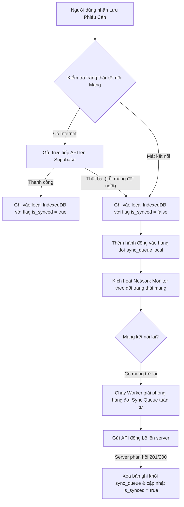

# KIẾN TRÚC HOẠT ĐỘNG NGOẠI TUYẾN (OFFLINE-FIRST ARCHITECTURE)
## RiceOS - Hệ thống Quản lý Thu mua Lúa gạo Thông minh

* **Dự án:** RiceOS
* **Phiên bản:** 1.0
* **Tác giả:** Phạm Tuân
* **Trạng thái:** Đề xuất

---

## 1. Lưu trữ Phía Client (Client-Side Storage - IndexedDB)

Do đặc thù trạm cân lúa thường nằm ngoài đồng ruộng hoặc trong nhà kho tôn kín sóng di động kém, RiceOS áp dụng cơ chế **Offline-First**. 

Ứng dụng Web App (chạy dưới dạng PWA) sử dụng **IndexedDB** làm cơ sở dữ liệu lưu trữ cục bộ trên thiết bị của cán bộ cân và thủ kho. Để đơn giản hóa lập trình, chúng tôi sử dụng thư viện **Dexie.js** hoặc **RxDB** để bọc ngoài IndexedDB.

```text
+---------------------------------------------------------------------------------+
|                               CLIENT DEVICE (PWA)                               |
|                                                                                 |
|   +------------------+     +--------------------+     +---------------------+   |
|   |  Giao diện App   | <-> | Local IndexedDB    | <-> | Hàng đợi đồng bộ    |   |
|   |                  |     | - weighing_receipts|     | (Sync Queue Table)  |   |
|   +------------------+     +--------------------+     +----------+----------+   |
|                                                                  |              |
+------------------------------------------------------------------|--------------+
                                                                   | 
                                                                   | Trình theo dõi mạng (Network Monitor)
                                                                   | phát hiện có Internet trở lại
                                                                   v
+---------------------------------------------------------------------------------+
|                               SUPABASE DATABASE                                 |
|                                                                                 |
|                        [ PostgreSQL Cloud Database ]                            |
+---------------------------------------------------------------------------------+
```

### Cấu trúc cơ sở dữ liệu IndexedDB Local:
1. **`weighing_receipts` (Bảng phiếu cân local):**
   * Lưu trữ toàn bộ các phiếu cân do thiết bị này tạo ra hoặc đồng bộ từ server về để hiển thị danh sách.
   * Chứa thêm trường flag: `is_synced` (`true`/`false`) và `is_dirty` (`true`/`false`).
2. **`sync_queue` (Bảng hàng đợi đồng bộ):**
   * Lưu danh sách các hành động thay đổi dữ liệu chưa được đẩy lên máy chủ.
   * Cấu trúc một bản ghi sync queue:
     ```json
     {
       "id": "UUID",
       "action": "CREATE | UPDATE",
       "table_name": "weighing_receipts",
       "payload": { ... },
       "created_at": 1785984023
     }
     ```
3. **`farmers_cache` và `varieties_cache`:**
   * Bản sao danh mục Nông dân và Giống lúa từ máy chủ đồng bộ về máy local đầu ngày làm việc, giúp Cán bộ cân tra cứu nhanh tức thì khi mất mạng.

---

## 2. Cơ chế Hàng đợi Đồng bộ (Sync Queue Mechanism)

Khi người dùng thực hiện thao tác Thêm hoặc Sửa phiếu cân:



### Các bước giải phóng hàng đợi (Queue Processing):
1. **Theo dõi trạng thái mạng (Network Monitor):** Sử dụng sự kiện `navigator.onLine` kết hợp với kiểm tra ping định kỳ tới server để phát hiện chính xác trạng thái kết nối mạng thực tế.
2. **Xử lý tuần tự (FIFO - First In, First Out):** Khi có mạng trở lại, một Background Worker sẽ được kích hoạt để đọc tuần tự các bản ghi trong bảng `sync_queue` từ cũ nhất đến mới nhất để xử lý, tránh tình trạng sai lệch trình tự logic (ví dụ: chạy hành động Update trước khi chạy hành động Create).
3. **Xác nhận thành công:** Chỉ khi server trả về mã trạng thái thành công (HTTP 200 OK hoặc 201 Created), client mới xóa bản ghi đó khỏi hàng đợi.

---

## 3. Chiến lược Giải quyết Xung đột Dữ liệu (Conflict Resolution Strategy)

Đối với dữ liệu phiếu cân thu mua lúa, nguyên tắc cốt lõi là **đảm bảo tính chính xác tài chính** và **quyết định của máy chủ là tối cao (Server-Authoritative)**.

### 3.1. Các kịch bản xung đột & cách xử lý:

* **Kịch bản 1: Sửa đổi trùng lặp (Double Update)**
  * *Tình huống:* Nhân viên cân sửa phiếu cân lần 1 ở máy local A (đang mất mạng). Trong lúc đó, kế toán cũng phát hiện sai và sửa thông tin phiếu đó trên máy tính B (có mạng). Khi máy A có mạng trở lại và đẩy yêu cầu Update lên server.
  * *Giải quyết (Server Wins / Last-Write-Wins based on Server Time):* Máy chủ Supabase sẽ so sánh mốc thời gian cập nhật. Khi máy A đẩy dữ liệu lên, server sẽ từ chối nếu dữ liệu trên server đã được cập nhật bởi một người dùng khác có mốc thời gian mới hơn. Server trả về lỗi xung đột (HTTP 409 Conflict) kèm dữ liệu mới nhất. Client của máy A sẽ ghi đè dữ liệu local bằng dữ liệu server và hiển thị thông báo: *"Dữ liệu phiếu cân đã được cập nhật từ văn phòng, thông tin local của bạn đã được làm mới."*

* **Kịch bản 2: Trùng số phiếu cân (Ticket Number Collision)**
  * *Tình huống:* Hai máy di động của hai nhân viên cân hoạt động độc lập lúc mất mạng và cùng tạo ra số phiếu cân trùng nhau (Ví dụ: `PC-HTX2-0005`).
  * *Giải quyết (Mã khóa duy nhất tự nhiên):* Khóa chính thực tế trong database của tất cả các bản ghi bắt buộc sử dụng định dạng **UUIDv4** sinh ngẫu nhiên phía Client (đảm bảo tỷ lệ trùng lặp bằng 0). Số phiếu cân hiển thị cho người dùng sẽ được sinh bằng cách kết hợp mã máy, mã cán bộ cân hoặc sử dụng cơ chế số ngẫu nhiên có tiền tố riêng biệt cho từng cán bộ để đảm bảo tính duy nhất tuyệt đối ngay cả khi offline.

* **Kịch bản 3: Đăng ký nhập kho vào Silo đã đầy**
  * *Tình huống:* Thủ kho offline bấm xác nhận nhập lúa vào Silo A. Nhưng thực tế trong lúc đó ở máy online khác, Silo A đã nhận đủ sản lượng từ xe khác và đã đầy.
  * *Giải quyết (Server-Validation Reject):* Khi máy thủ kho online trở lại và đồng bộ lệnh nhập kho, database trigger trên server kiểm tra thấy sức chứa của Silo A bị vượt quá giới hạn. Server từ chối lệnh nhập kho, trả về mã lỗi validation. Ứng dụng của thủ kho sẽ hiển thị cảnh báo đỏ yêu cầu thủ kho chọn Silo khác trên giao diện để cập nhật lại.
