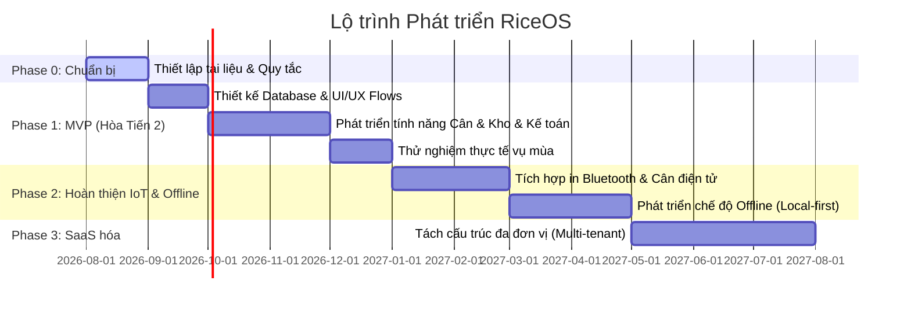

# LỘ TRÌNH PHÁT TRIỂN SẢN PHẨM (PRODUCT ROADMAP)
## RiceOS - Hệ thống Quản lý Thu mua Lúa gạo Thông minh

* **Dự án:** RiceOS
* **Phiên bản:** 1.0
* **Tác giả:** Phạm Tuân
* **Trạng thái:** Đề xuất

---

Lộ trình phát triển RiceOS được chia làm 4 giai đoạn chiến lược, đi từ việc giải quyết bài toán vận hành thực tế tại Hợp tác xã Hòa Tiến 2 đến việc mở rộng thành sản phẩm SaaS thương mại toàn quốc.

---

## Giai đoạn chi tiết:

### 📍 Phase 0: Khởi tạo & Đặc tả (Tháng 08/2026)
* **Mục tiêu:** Thiết lập nền tảng tài liệu dự án, quy tắc phát triển, mô hình nghiệp vụ sơ bộ và ma trận phân quyền.
* **Kết quả đầu ra:** 
  * Bộ tài liệu hướng dẫn phát triển, tiêu chuẩn code.
  * Tài liệu đặc tả vai trò người dùng và nghiệp vụ.
  * Kế hoạch kiểm thử sơ bộ.

### 📍 Phase 1: Xây dựng MVP - Phiên bản lõi cho HTX Hòa Tiến 2 (Tháng 09/2026 - Tháng 12/2026)
* **Mục tiêu:** Xây dựng phần mềm lõi đáp ứng quy trình thu mua lúa thủ công trên điện thoại và máy tính.
* **Các chức năng chính:**
  * Quản lý danh mục Nông dân, Thương lái, Loại lúa.
  * Module tạo Phiếu cân lúa (Gross, Tare, Net Weight, Độ ẩm, Tạp chất).
  * Module xác nhận Nhập kho và chọn Silo chứa lúa.
  * Module Kế toán tính toán quyết toán tự động, lập phiếu chi.
  * Dashboard giám sát tổng sản lượng và dòng tiền cơ bản cho Giám đốc.
* **Cột mốc quan trọng:** Triển khai chạy thử nghiệm thực tế (Pilot) trực tiếp tại Trạm thu mua của HTX Hòa Tiến 2 vào vụ thu hoạch Đông Xuân (Tháng 12/2026).

### 📍 Phase 2: Tối ưu hóa Vận hành Ngoài đồng & Tích hợp IoT (Tháng 01/2027 - Tháng 04/2027)
* **Mục tiêu:** Tối ưu trải nghiệm sử dụng thực tế ngoài hiện trường và tự động hóa ghi nhận dữ liệu.
* **Các chức năng chính:**
  * Tích hợp tính năng in phiếu cân di động qua Bluetooth tới máy in nhiệt mini cầm tay.
  * Xây dựng cơ chế **Offline-First**: Cho phép nhân viên cân ghi phiếu cân khi mất mạng, lưu trữ cục bộ trên thiết bị và tự động đồng bộ khi có kết nối trở lại.
  * Tích hợp thử nghiệm kết nối API trực tiếp với đầu cân điện tử (không cần nhập tay khối lượng).
  * Nâng cấp giao diện Mobile-first với chữ siêu lớn, nút bấm to phù hợp điều kiện ánh sáng chói ngoài đồng ruộng.

### 📍 Phase 3: SaaS hóa - Mở rộng quy mô đa đơn vị (Tháng 05/2027 - Tháng 08/2027)
* **Mục tiêu:** Chuyển đổi kiến trúc hệ thống để có thể cung cấp dịch vụ phần mềm (SaaS) cho nhiều hợp tác xã khác nhau đăng ký sử dụng.
* **Các chức năng chính:**
  * Triển khai kiến trúc đa người thuê (Multi-tenant) cô lập dữ liệu tuyệt đối giữa các hợp tác xã bằng PostgreSQL Row Level Security (RLS).
  * Module đăng ký tài khoản HTX mới, cấu hình thông tin HTX riêng biệt.
  * Module thanh toán phí thuê bao tháng/năm.
  * Cho phép tùy biến quy trình duyệt phiếu chi tiền và biểu mẫu in hóa đơn theo đặc thù từng địa phương.

### 📍 Phase 4: Tích hợp AI & Thanh toán tự động (Dự kiến sau Tháng 09/2027)
* **Mục tiêu:** Nâng cấp hệ thống thông minh hơn để gia tăng giá trị chuỗi cung ứng.
* **Các chức năng chính:**
  * Tích hợp API ngân hàng (VietQR Pro/Napas) tự động chuyển tiền thanh toán cho nông dân ngay khi Giám đốc phê duyệt phiếu chi trên ứng dụng.
  * Thử nghiệm AI classification: Đánh giá chất lượng lúa qua camera điện thoại để đưa ra đề xuất đơn giá thu mua phù hợp.
