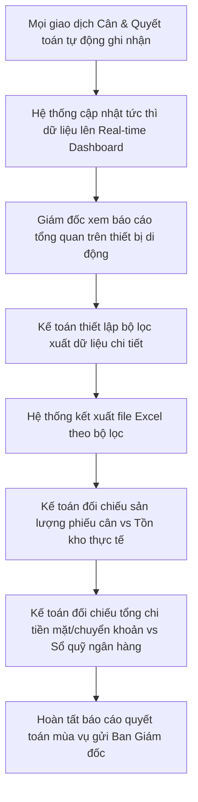

# QUY TRÌNH BÁO CÁO & ĐỐI CHIẾU SỐ LIỆU (REPORTING & RECONCILIATION WORKFLOW)
## RiceOS - Hệ thống Quản lý Thu mua Lúa gạo Thông minh

* **Tài liệu:** Hướng dẫn quy trình kết xuất báo cáo và đối chiếu số liệu tài chính, sản lượng định kỳ.
* **Đối tượng thực hiện:** Kế toán (Accountant), Giám đốc Hợp tác xã (Director).
* **Mục tiêu:** Cung cấp thông tin tài chính - sản lượng chính xác cho ban giám đốc, hỗ trợ kế toán đối soát số liệu thu mua cuối vụ mùa.

---

## 1. Lưu đồ Quy trình (Reporting Flow Chart)

---

## 2. Mô tả chi tiết quy trình báo cáo

### 2.1. Giám sát thời gian thực (Real-time Monitoring)
* **Xử lý hệ thống:** Mỗi khi một phiếu cân được xác nhận cân vỏ thành công hoặc một phiếu thanh toán được chuyển sang trạng thái "Đã thanh toán", hệ thống tự động cập nhật lại các chỉ số tổng hợp trên cơ sở dữ liệu.
* **Trải nghiệm Giám đốc:** Giám đốc mở ứng dụng RiceOS trên điện thoại, truy cập Dashboard để xem tức thì các báo cáo:
  * **Báo cáo sản lượng thu mua ngày:** So sánh sản lượng lúa nhập kho giữa các ngày trong tuần để theo dõi tiến độ thu hoạch của bà con nông dân.
  * **Báo cáo dòng tiền thu mua:** Tổng số tiền đã chi trả, tổng số tiền kế toán đang làm phiếu chờ phê duyệt để chuẩn bị quỹ tiền mặt hoặc số dư tài khoản ngân hàng của HTX.
  * **Báo cáo phân bổ giống lúa:** Biểu đồ hiển thị tỷ lệ % các giống lúa thu mua (giúp định hướng kế hoạch bán gạo sấy cho các nhà máy xuất khẩu).

### 2.2. Kết xuất báo cáo định kỳ (Excel Export)
* **Thao tác:** Cuối mỗi ngày hoặc định kỳ hàng tuần, Kế toán truy cập màn hình báo cáo tổng hợp.
* **Nhập liệu đầu vào:** Kế toán chọn các tiêu chí lọc báo cáo:
  * Khoảng thời gian (Ví dụ: Từ ngày 01/08/2026 đến ngày 06/08/2026).
  * Lọc theo đối tác (Một nông dân cụ thể hoặc tất cả).
  * Lọc theo giống lúa hoặc trạng thái thanh toán.
* **Kết quả:** Nhấn nút "Xuất file Excel". Hệ thống sinh file Excel (.xlsx) chuẩn hóa định dạng biểu bảng của Hợp tác xã phục vụ lưu trữ pháp lý và in ấn báo cáo giấy gửi UBND xã/huyện.

### 2.3. Đối chiếu số liệu cuối vụ mùa (End-of-Season Reconciliation)
Quy trình đối soát bắt buộc của kế toán trước khi khóa sổ vụ mùa:

1. **Đối soát Sản lượng:**
   * Tính tổng khối lượng tịnh (`Net Weight`) trên tất cả phiếu cân lúa trong vụ mùa.
   * Đối chiếu với tổng số lượng lúa nhập kho thực tế do thủ kho ghi nhận trên hệ thống và lượng lúa đã xuất kho sấy bán cho doanh nghiệp.
2. **Đối soát Tài chính:**
   * Tổng số tiền trên các phiếu chi trạng thái `Đã thanh toán` phải khớp chính xác với số tiền giảm trừ trên Sổ quỹ tiền mặt của HTX và sao kê tài khoản ngân hàng giao dịch.
   * Xác minh các mã số giao dịch ngân hàng đã nhập trên RiceOS khớp với các lệnh chuyển khoản thực tế trên Internet Banking.
