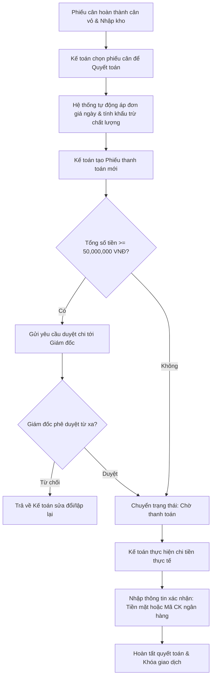

# QUY TRÌNH QUYẾT TOÁN (SETTLEMENT WORKFLOW)
## RiceOS - Hệ thống Quản lý Thu mua Lúa gạo Thông minh

* **Tài liệu:** Hướng dẫn luồng thanh toán và quyết toán tài chính tiền lúa cho nông dân.
* **Đối tượng thực hiện:** Kế toán (Accountant), Giám đốc Hợp tác xã (Director).
* **Mục tiêu:** Tính toán chính xác giá trị đơn hàng, duyệt chi và chuyển tiền nhanh chóng cho nông dân.

---

## 1. Lưu đồ Quy trình Quyết toán (Settlement Flow Chart)

---

## 2. Mô tả chi tiết từng bước

### Bước 1: Tiếp nhận dữ liệu phiếu cân đã nhập kho
* Khi thủ kho xác nhận lúa đã đổ vào silo và trạm cân đã hoàn thành cân vỏ xe tải, phiếu cân được đẩy sang danh sách chờ quyết toán trên màn hình máy tính của Kế toán.

### Bước 2: Tính tiền tự động và áp đơn giá ngày
* **Xử lý hệ thống:**
  * Hệ thống tự động xác định Đơn giá ngày tương ứng với Giống lúa đã ghi nhận.
  * Tự động tính toán khối lượng quy đổi sau khi trừ tỷ lệ độ ẩm vượt tiêu chuẩn (>14%) và tạp chất vượt tiêu chuẩn (>1%).
  * Tự động tính Tổng tiền thanh toán: `Tổng tiền = Khối lượng quy đổi * Đơn giá`.
* **Thao tác:** Kế toán kiểm tra lại bảng tính tiền chi tiết trên giao diện.

### Bước 3: Phân luồng phê duyệt tài chính (Hạn mức 50 triệu VNĐ)
* **Trường hợp 1 (Tự động duyệt):** Nếu số tiền quyết toán `< 50.000.000 VNĐ`. Khi kế toán bấm "Xác nhận lập phiếu chi", hệ thống tự động duyệt phiếu và chuyển trạng thái sang `Chờ thanh toán`.
* **Trường hợp 2 (Giám đốc duyệt):** Nếu số tiền quyết toán `≥ 50.000.000 VNĐ`. Hệ thống khóa tính năng thanh toán trực tiếp của kế toán, chuyển phiếu sang trạng thái `Chờ phê duyệt` và đẩy thông báo duyệt chi lên ứng dụng di động của Giám đốc.
  * Giám đốc bấm **Duyệt (Approve)** -> Phiếu chuyển sang `Chờ thanh toán`.
  * Giám đốc bấm **Từ chối (Reject)** -> Ghi chú lý do -> Phiếu trả về cho kế toán ở dạng nháp để điều chỉnh (ví dụ: cần điều chỉnh đơn giá thỏa thuận hoặc kiểm tra lại khối lượng lúa).

### Bước 4: Thực hiện thanh toán và lưu lịch sử
* **Thao tác:** Kế toán thực hiện chi trả tiền thực tế cho nông dân/thương lái:
  * **Nếu chi tiền mặt:** Kế toán phát tiền trực tiếp và hướng dẫn nông dân ký tên vào phiếu chi giấy in ra từ hệ thống.
  * **Nếu chuyển khoản:** Kế toán mở Internet Banking ngân hàng của HTX, thực hiện chuyển tiền vào số tài khoản của nông dân (hiển thị sẵn trên màn hình chi tiết của ứng dụng). Sau khi chuyển thành công, kế toán copy **Mã giao dịch ngân hàng** và dán vào trường xác nhận trên RiceOS.
* **Kết quả:** Bấm "Xác nhận đã thanh toán". Phiếu chi chuyển sang trạng thái `Đã thanh toán` (Settled) và được khóa vĩnh viễn trên cơ sở dữ liệu để bảo mật.
