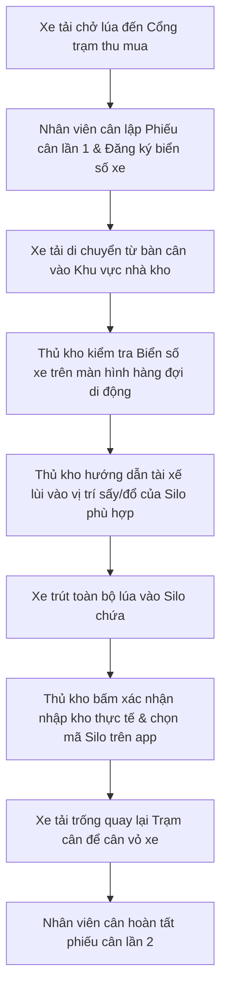

# QUY TRÌNH TIẾP NHẬN XE HÀNG & NHẬP KHO (TRUCK RECEPTION & WAREHOUSE WORKFLOW)
## RiceOS - Hệ thống Quản lý Thu mua Lúa gạo Thông minh

* **Tài liệu:** Hướng dẫn luồng điều phối xe tải tại trạm thu mua và xác nhận nhập lúa vào kho chứa.
* **Đối tượng thực hiện:** Nhân viên trạm cân (Weighing Officer), Thủ kho (Warehouse Keeper).
* **Mục tiêu:** Điều phối xe tải chở lúa di chuyển khoa học, nhập kho đúng chủng loại lúa, tránh ùn tắc và sai lệch silo chứa.

---

## 1. Lưu đồ Điều phối Xe hàng (Truck Reception Flow Chart)

---

## 2. Mô tả chi tiết quy trình tiếp nhận xe

### 2.1. Đăng ký biển số & xếp hàng đợi trạm cân (Tại Cổng trạm thu mua)
* Xe tải chở lúa của nông dân hoặc thương lái xếp hàng ngoài cổng trạm.
* Khi đến lượt xe đè lên bàn cân điện tử, nhân viên cân lập phiếu cân tạm thời bằng cách ghi nhận biển số xe tải (Ví dụ: `43C-123.45`), giống lúa và chủ xe. Lúc này, xe tải được ghi nhận trạng thái **"Đang ở bàn cân Gross"**.

### 2.2. Xếp hàng đợi nhập kho (Tại Khu vực Nhà kho)
* Sau khi cân Gross và đo độ ẩm xong, xe di chuyển vào trong kho.
* Ứng dụng di động của Thủ kho tự động hiển thị xe tải vừa cân xong trong màn hình **"Hàng đợi xe chờ nhập kho"**. Thủ kho có thể nhìn thấy danh sách các xe xếp hàng theo thứ tự thời gian cân lần 1 để gọi xe vào trút lúa một cách công bằng.

### 2.3. Đổ lúa vào kho chứa (Silo/Đống chứa)
* Khi đến lượt xe, thủ kho đối chiếu biển số xe tải thực tế với biển số hiển thị trên ứng dụng di động của mình.
* Thủ kho hướng dẫn xe di chuyển đến đúng Silo sấy hoặc đống chứa lúa tương ứng với giống lúa ghi nhận trên phiếu cân.
* **Quy tắc quan trọng:** Hệ thống tự động lọc ra các Silo đang trống hoặc các Silo đang chứa đúng loại giống lúa của xe đó. Thủ kho bắt buộc phải chọn một Silo trong danh sách này để xác nhận nhập. Hệ thống sẽ báo lỗi và ngăn chặn nếu thủ kho cố tình đổ lúa Đài Thơm 8 vào Silo đang chứa lúa OM18.

### 2.4. Giải phóng xe để cân vỏ
* Sau khi trút hết lúa xuống hầm nhận của Silo, thủ kho nhấn nút **"Xác nhận nhập kho"** trên ứng dụng di động.
* Trạng thái xe trên hệ thống chuyển sang **"Đang nhập kho - Chờ cân vỏ"**.
* Xe tải di chuyển ra khỏi nhà kho, quay trở lại bàn cân của trạm cân để cân vỏ xe (Tare) và in phiếu xác nhận sản lượng cuối cùng.
