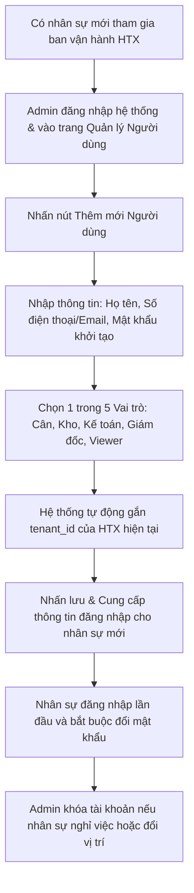

# QUY TRÌNH QUẢN LÝ NGƯỜI DÙNG (USER MANAGEMENT WORKFLOW)
## RiceOS - Hệ thống Quản lý Thu mua Lúa gạo Thông minh

* **Tài liệu:** Hướng dẫn quy trình cấp phát tài khoản, phân quyền và quản lý nhân sự trên hệ thống.
* **Đối tượng thực hiện:** Quản trị viên hệ thống (Administrator).
* **Mục tiêu:** Kiểm soát chặt chẽ quyền truy cập hệ thống, đảm bảo an toàn bảo mật thông tin và đúng vai trò chức năng vận hành của HTX.

---

## 1. Lưu đồ Quy trình (User Management Flow Chart)

---

## 2. Mô tả chi tiết quy trình quản lý người dùng

### 2.1. Cấp tài khoản mới
* **Thao tác:** Khi Hợp tác xã tuyển thêm nhân viên trạm cân hoặc thay đổi kế toán mới, Quản trị viên (Admin) đăng nhập vào ứng dụng RiceOS bằng tài khoản admin của mình.
* **Quy trình nhập liệu:**
  * Truy cập trang **"Quản lý người dùng"** và chọn **"Thêm thành viên mới"**.
  * Nhập đầy đủ thông tin: Họ và tên cán bộ, Số điện thoại (bắt buộc dùng để đăng nhập và nhận thông tin xác thực), Địa chỉ email (không bắt buộc).
  * Thiết lập một mật khẩu mặc định an toàn cho lần đăng nhập đầu tiên.
  * Lựa chọn vai trò phù hợp nhất với nhiệm vụ của nhân sự mới (ví dụ: nhân sự trực trạm cân chọn vai trò `Cán bộ cân`).
* **Xử lý hệ thống:** 
  * Hệ thống tự động gán mã `tenant_id` của Hợp tác xã đang quản lý vào bản ghi người dùng mới (đảm bảo tính bảo mật cô lập dữ liệu multi-tenant).
  * Kiểm tra trùng lặp Số điện thoại/Email trong cơ sở dữ liệu. Nếu hợp lệ, tạo bản ghi tài khoản mới ở trạng thái `Hoạt động` (Active).

### 2.2. Đổi mật khẩu lần đầu (First-time Login)
* **Thao tác:** Nhân sự mới nhận thông tin tài khoản đăng nhập từ Admin.
* **Quy trình:**
  * Đăng nhập vào RiceOS bằng Số điện thoại và mật khẩu khởi tạo.
  * Hệ thống phát hiện đây là lần đăng nhập đầu tiên, tự động hiển thị màn hình yêu cầu bắt buộc đổi mật khẩu mới để bảo mật.
  * Nhân sự nhập mật khẩu mới (yêu cầu tối thiểu 8 ký tự, bao gồm cả chữ và số). Sau khi đổi thành công, nhân sự được chuyển hướng tới màn hình làm việc tương ứng với vai trò của mình.

### 2.3. Khóa tài khoản (Deactivation)
* **Thói quen bảo mật:** Khi một cán bộ nghỉ việc hoặc chuyển công tác khỏi Hợp tác xã, tài khoản của họ phải bị vô hiệu hóa ngay lập tức để tránh rò rỉ dữ liệu hoặc thay đổi số liệu thu mua bất hợp pháp.
* **Quy trình thực hiện:**
  * Admin tìm kiếm tài khoản của cán bộ đó trong danh sách người dùng.
  * Bấm nút **"Khóa tài khoản"** (Deactivate).
  * Trạng thái tài khoản chuyển sang `Khóa` (Inactive).
  * **Quy tắc hệ thống:** Mọi Token đăng nhập hiện tại của tài khoản này sẽ bị thu hồi lập tức trên máy chủ (Session Revocation). Người dùng này không thể thực hiện bất kỳ truy vấn API nào nữa.
