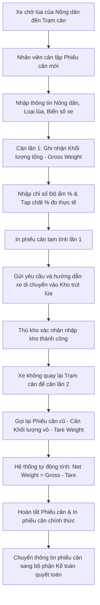

# QUY TRÌNH CÂN LÚA (WEIGHING WORKFLOW)
## RiceOS - Hệ thống Quản lý Thu mua Lúa gạo Thông minh

* **Tài liệu:** Hướng dẫn luồng xử lý kỹ thuật quy trình cân lúa.
* **Đối tượng thực hiện:** Nhân viên cân (Weighing Officer).
* **Mục tiêu:** Ghi nhận khối lượng lúa chính xác qua 2 bước cân xe.

---

## 1. Lưu đồ Quy trình (Weighing Flow Chart)

---

## 2. Mô tả chi tiết từng bước

### Bước 1: Tiếp nhận và Lập phiếu cân lần 1
* **Thao tác:** Khi xe tải chở lúa đỗ trên bàn cân, nhân viên trạm cân mở ứng dụng RiceOS trên điện thoại di động và nhấn nút "Tạo phiếu cân mới".
* **Nhập liệu đầu vào:**
  * Chọn thông tin Nông dân/Thương lái (hệ thống hỗ trợ tìm kiếm nhanh theo Tên hoặc Số điện thoại).
  * Chọn giống lúa đang thu mua (ví dụ: OM18).
  * Nhập biển số xe tải chở lúa.
  * Nhập Khối lượng tổng (`Gross Weight` - tính bằng kg, đọc từ đầu cân điện tử hoặc nhập tay).
  * Sử dụng máy đo độ ẩm cầm tay để đo lúa trực tiếp trên xe, nhập chỉ số Độ ẩm (`Moisture` - %).
  * Kiểm tra cảm quan tạp chất, nhập chỉ số Tạp chất (`Trash` - %).
* **Xử lý hệ thống:** Hệ thống tự động kiểm tra xem các chỉ số chất lượng có nằm trong ngưỡng cho phép không. Nếu hợp lệ, hệ thống tạo bản ghi Phiếu cân ở trạng thái `Chờ nhập kho` (Pending Warehouse).
* **Kết quả:** In phiếu cân tạm tính lần 1 gửi tài xế xe tải.

### Bước 2: Xe trút lúa vào kho (Giai đoạn trung gian)
* Xe tải di chuyển từ bàn cân vào nhà kho. Thủ kho hướng dẫn xe lùi vào đúng vị trí Silo sấy hoặc đống lúa tương ứng.
* Sau khi trút hết lúa, Thủ kho xác nhận trên ứng dụng của mình (Xem chi tiết tại [Quy trình xe nhận](truck_reception.md)).

### Bước 3: Cân vỏ xe (Cân lần 2) và Hoàn tất
* **Thao tác:** Xe tải trống quay lại bàn cân. Nhân viên trạm cân tìm kiếm phiếu cân của xe tải theo biển số xe (trạng thái phiếu lúc này là `Chờ cân vỏ`).
* **Nhập liệu đầu vào:**
  * Nhập Khối lượng vỏ xe (`Tare Weight` - tính bằng kg).
* **Xử lý hệ thống:**
  * Hệ thống tự động kiểm tra điều kiện logic: `Tare Weight` phải nhỏ hơn `Gross Weight`.
  * Hệ thống tự động tính toán Khối lượng tịnh thực tế của lúa: `Net Weight = Gross Weight - Tare Weight`.
  * Hệ thống tự động chuyển đổi trạng thái phiếu cân thành `Đã nhập kho` (Chờ quyết toán).
* **Kết quả:** In phiếu cân chính thức K57/K80 cho tài xế ký xác nhận sản lượng thực tế đã giao cho Hợp tác xã.
